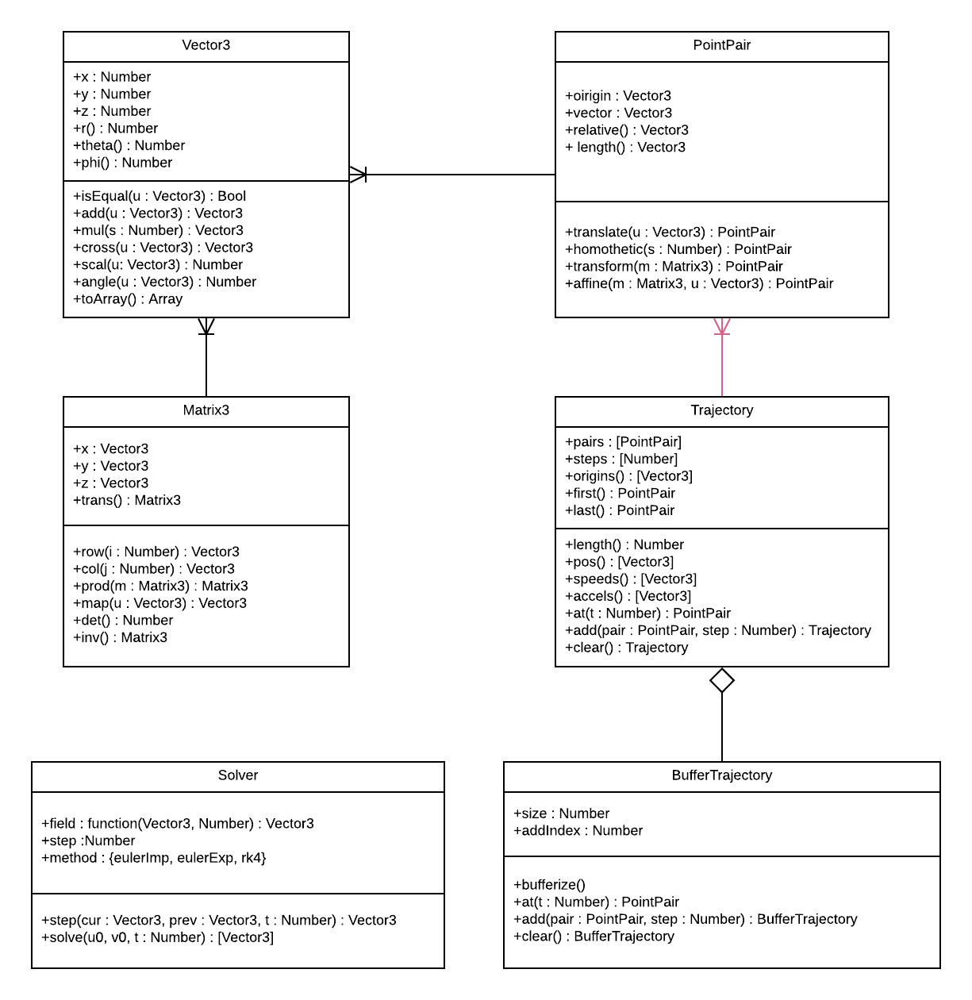

# meca3

## Represent 3D space and movement

### Introduction
meca3 is a **mechanics framework**. It represents **3D space** and provides a **solver**
and an interface to compute **trajectory** of **moving bodies**.

- **object oriented** memory efficient syntax to perform mathematical operations.
- **3D optimized implementation** of common vectors and
matrix operations to provide fast computation.
- **lightweight solver** to perform either step by step or global ODE solving

### Install
Use `npm i meca3` in terminal to import package into your `node_modules` directory.
Import each class you want use the following syntax :

```js
const Vector3 = require("[path_to_meca3]/Vector3.mjs");
```

### Run unit tests
Unit testing is performed using **mocha** and **chai** frameworks. 
Install the framework and go to the test directory. 
For each class .mjs file a unit test file is provided.

## Documentation

### Getting Started

#### Basic concepts

meca3 library is designed to :
- Represent a _vector_ and a _point_ in 3D space
- Represent the _trajectory_ of a point in 3D space
- Represent a _3x3 matrix_
- Perform _geometrical transformations_
- Solve ODE representing a point moving into a time dependant _field_

The package has an object oriented structure as follows :


**Notes :** 
- This diagram represents **only the main features** of the package.
- Red relationships means that strong referencing is used.
- Properties suffixed by `()` are Javascript **method property**

The object oriented structure allows to perform operations chaining with manual copy management :
```js
    var u = v.copy().add(w); // Creates a new Vector3 : u = v + w
    v.add(w); // Add w into v : v = v + w
```
**Note :**  The first line does not change v or w.

Each class and method is documented within the code so you can precisely determine the
inputs and outputs of a function.